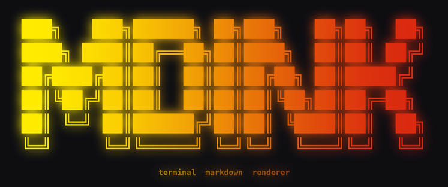

# mdink

<p align="center">
  
</p>

A terminal markdown renderer with syntax highlighting and inline images. Inspired by [glow](https://github.com/charmbracelet/glow), built in Rust on [ratatui](https://ratatui.rs).

```
mdink README.md
```

**[Full documentation →](https://github.com/mdink-rs/mdink/wiki)**

## Features

- **Headings** (h1–h6) with distinct colors and font-slot modifiers
- **Inline formatting** — bold, italic, bold+italic, strikethrough, inline code
- **Syntax-highlighted code blocks** — 40+ languages via syntect (base16-ocean theme)
- **Lists** — unordered, ordered, task lists, up to 4 levels deep
- **Block quotes** — nested, with full inline formatting
- **Tables** — column alignment, CJK-aware width calculation
- **Horizontal rules**
- **Outline panel** — toggle a table-of-contents sidebar (`o`) with heading navigation, jump-to-heading, and resizable width
- **Terminal images** — Sixel, Kitty, iTerm2, and half-block fallback; degrades gracefully to alt text
- **ASCII image rendering** — `--ascii-images` converts images to colored ASCII art using Unicode half-blocks; works on *every* terminal, no graphics protocol needed
- **Images in tables** — embed images inside GFM table cells with automatic sizing
- **Responsive layout** — re-flows at the correct width on every terminal resize

## Installation

### From crates.io

```bash
cargo install mdink
```

### Pre-built binaries

Pre-built binaries (Linux x86\_64/aarch64, macOS x86\_64/aarch64, Windows x86\_64) and a Debian `.deb` package are available on the [releases page](https://github.com/mdink-rs/mdink/releases). See the [Installation wiki page](https://github.com/mdink-rs/mdink/wiki/Installation) for full instructions including shell completions and the man page.

## Usage

```
mdink <FILE>
mdink --ascii-images <FILE>   # render images as colored ASCII art
mdink --no-images <FILE>      # disable image rendering entirely
```

The `--ascii-images` flag renders images as colored Unicode half-block art — useful on terminals without graphics protocol support (plain SSH sessions, older terminals, screen/tmux). The `--no-images` flag disables all image rendering for faster startup.

## Navigation

| Key | Action |
|-----|--------|
| `j` / `↓` | Scroll down one line |
| `k` / `↑` | Scroll up one line |
| `d` / `PgDn` | Scroll down half a page |
| `u` / `PgUp` | Scroll up half a page |
| `g` / `Home` | Jump to top |
| `G` / `End` | Jump to bottom |
| `o` | Toggle outline panel |
| `Tab` / `Shift+Tab` | Navigate outline headings |
| `Enter` | Jump to selected heading |
| `<` / `>` | Shrink / grow outline panel |
| `q` / `Esc` / `Ctrl+C` | Quit |

## Image support

mdink renders images using the best available method for your terminal:

| Terminal | Protocol |
|----------|----------|
| Kitty | Kitty graphics protocol |
| WezTerm | Kitty graphics protocol |
| iTerm2 (macOS) | iTerm2 inline images |
| Alacritty ≥ 0.13 | Sixel |
| Most others | Half-block fallback (Unicode block elements) |

### ASCII image mode

For terminals with no graphics protocol at all (plain SSH, screen, tmux, older terminals), use `--ascii-images` to render images as colored ASCII art using Unicode half-block characters (`▀▄█`). The ASCII renderer uses terminal font metrics to scale images proportionally. This mode also works for images embedded inside GFM table cells.

```
mdink --ascii-images README.md
```

You can make this the default by adding `"ascii_images": true` to `~/.config/mdink/config.json`.

On unsupported terminals without `--ascii-images`, images fall back to their alt text. Use `--no-images` to skip image rendering entirely.

## Minimum Rust version

**1.86.0** (edition 2024)

## License

MIT
