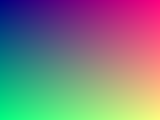

# ASCII Image Rendering Test

## GitLab Logo (256x256, RGBA)

## Facebook Logo (256x256, RGB)

## Maven Logo (256x256, RGBA)

## Small images for comparison

## Mixed content

Some text before an image.

Some text after the image. Here is **bold** and *italic* text to verify
the parser still handles inline formatting alongside images.

> A blockquote after images to check nothing bleeds.
